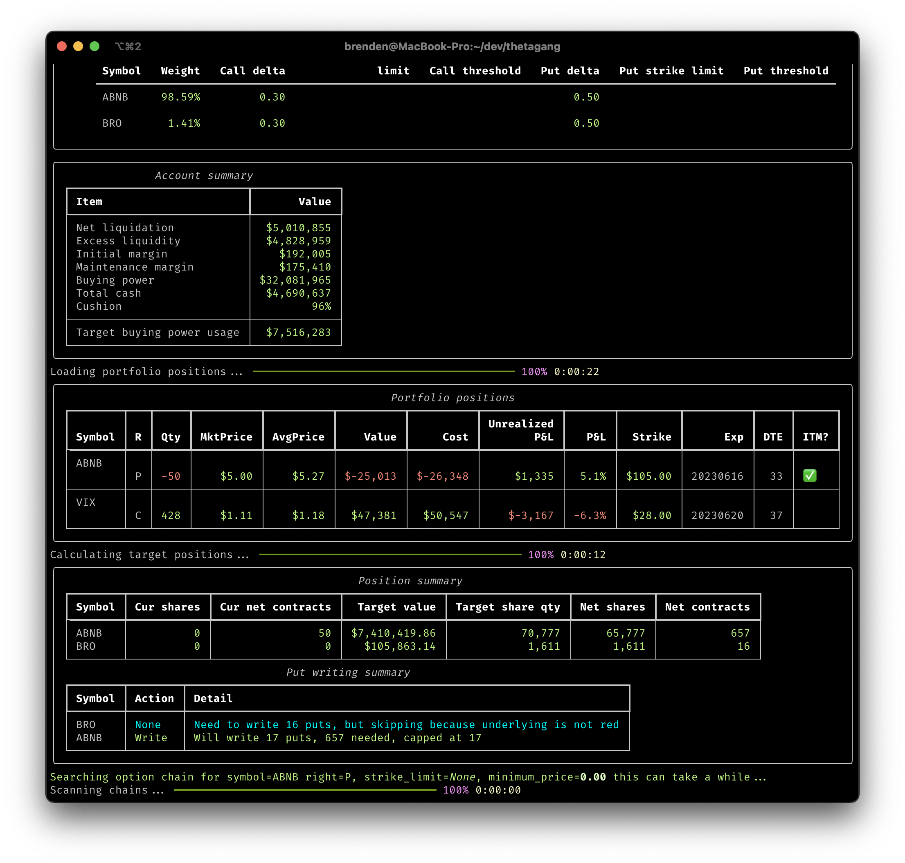

[](https://hub.docker.com/r/brndnmtthws/thetagang) [](https://pypi.org/project/thetagang/) [](https://hub.docker.com/r/brndnmtthws/thetagang) [](https://pypi.python.org/pypi/thetagang/)

[💬 Join the Matrix chat, we can get money together](https://matrix.to/#/#thetagang:frens.io).

# Θ ThetaGang Θ

_Beat the capitalists at their own game with ThetaGang 📈_


ThetaGang is an [IBKR](https://www.interactivebrokers.com/) trading bot for
collecting premium by selling options using "The Wheel" strategy. The Wheel
is a strategy that [surfaced on
Reddit](https://www.reddit.com/r/options/comments/a36k4j/the_wheel_aka_triple_income_strategy_explained/),
but has been used by many in the past. This bot implements a slightly
modified version of The Wheel, with my own personal tweaks.

## Risk Disclaimer

**⚠️ WARNING: Options trading involves substantial risk and is not suitable for
all investors.** Selling options can result in significant losses, potentially
exceeding your initial investment. Selling naked puts has theoretically unlimited
downside risk if the underlying asset goes to zero. This is not a "free money"
strategy—you are being compensated for taking on real financial risk.

Before using ThetaGang:
- Understand that you can lose money, especially in trending or volatile markets
- Ensure you have sufficient capital to handle worst-case scenarios
- Be prepared to own the underlying securities at potentially unfavorable prices
- Consider paper trading first to understand the mechanics and risks
- Consult with a financial advisor if you're unsure about the risks

## How it works

Start by reading [the Reddit
post](https://www.reddit.com/r/options/comments/a36k4j/the_wheel_aka_triple_income_strategy_explained/)
to get some background.

The strategy, as implemented here, does a few things differently from the one
described in the post above. For one, it's intended to be used to augment a
typical index-fund based portfolio with specific asset allocations. The
default configuration includes a diversified portfolio with SPY (40%), QQQ
(30%), TLT (20%), and smaller positions in individual stocks. This strategy
reduces risk, but may also limit gains from big market swings. By reducing
risk, one can increase leverage.

ThetaGang is quite configurable, and you can adjust the parameters to suit your
preferences and needs, but the default configuration is designed to be a good
starting point. ThetaGang makes some assumptions about how to run this strategy,
but you can tweak it to your liking by modifying the
[`thetagang.toml`](https://github.com/brndnmtthws/thetagang/blob/main/thetagang.toml)
file.

The main difference between ThetaGang and simply buying and holding index funds
is that this script will attempt to harvest volatility by selling options,
rather than buying shares directly. This works because implied volatility is
typically higher than realized volatility on average. Instead of buying shares,
you write puts. This has pros and cons, which are outside the scope of this
README.

ThetaGang can also be used in combination with other strategies such as PMCCs,
Zebra, stock replacement, and so forth. For these strategies, however, ThetaGang
will not manage long positions for you. You will need to manage these positions
yourself. ThetaGang will, however, continue to execute the short legs of these
strategies as long as you have the buying power available and set the
appropriate configuration (in particular, by setting
`write_when.calculate_net_contracts = true`).

You could use this tool on individual stocks, but I don't
recommend it because I am not smart enough to understand which stocks to buy.
That's why I buy index funds.

ThetaGang will try to acquire your desired allocation of each stock or ETF
according to the weights you specify in the config. To acquire the positions,
the script will write puts when conditions are met (config parameters, adequate
buying power, acceptable contracts are available, enough shares needed, etc).

ThetaGang will continue to roll any open option positions indefinitely, with the
only exception being ITM puts (although this is configurable). Once puts are in
the money, they will be ignored until they expire and are exercised (after which
you will own the underlying). When rolling puts, the strike of the new contracts
are capped at the old strike plus the premium received (to prevent your account
from blowing due to over-ratcheting up the buying power usage).

**⚠️ IMPORTANT RISK WARNING**: Selling naked puts has unlimited downside risk.
If the underlying goes to $0, you lose the full strike price × 100 shares per
contract, minus the small premium received. Selling options is NOT "free money"
and only makes sense when:
- You're willing to own the underlying at the strike price
- You believe implied volatility exceeds realized volatility
- You have adequate capital to handle worst-case scenarios
- You understand and accept the risks involved

This strategy can and will lose money in trending markets or during sharp
declines. The premium collected is compensation for taking on this risk.

If puts are exercised due to being ITM at expiration, you will own the stock,
and ThetaGang switches from writing puts to writing calls at a strike at least
as high as the average cost of the stock held. To avoid missing out on upward
moves, you can limit the number of calls that are written with
`write_when.calls.cap_factor`, such as setting this to 0.5 to limit the number
of calls to 50% of the shares held.

Please note: this strategy is based on the assumption that implied volatility
is, on average, always higher than realized volatility. In cases where this
is not true, this strategy will cause you to lose money.

In the case of deep ITM calls, the bot will prefer to roll the calls to next
strike or expiration rather than allowing the underlying to get called away. If
you don't have adequate buying power available in your account, it's possible
that the options may get exercised instead of rolling forward and the process
starts back at the beginning. Please keep in mind this may have tax
implications, but that is outside the scope of this README.

In normal usage, you would run the script as a cronjob on a daily, weekly, or
monthly basis according to your preferences. Running more frequently than
daily is not recommended, but the choice is yours.



### VIX call hedging

ThetaGang can optionally hedge your account by purchasing VIX calls for the next
month based on specified parameters. The strategy is based on the [Cboe VIX Tail
Hedge Index](https://www.cboe.com/us/indices/dashboard/vxth/), which you can
read about on the internet. You can enable this feature in `thetagang.toml`
with:

```toml
[vix_call_hedge]
enabled = true
```

Default values are provided, based on the VXTH index, but you may configure
them to your taste. Key parameters include:

```toml
[vix_call_hedge]
enabled = true
allocation = 0.01  # 1% of buying power
close_hedges_when_vix_exceeds = 50  # Auto-close at high VIX
ignore_dte = 5  # Don't hedge if expiry within 5 days
```

See [`thetagang.toml`](https://github.com/brndnmtthws/thetagang/blob/6eab3823120c10c0563e02c5d7f30dfcc0e333fc/thetagang.toml#L294-L331)
for all available options.

Buying VIX calls is not free, and it _will_ create some drag on your portfolio,
but in times of extreme volatility–such as the COVID-related 2020 market
panic–VIX calls can provide outsized returns.

### Cash management

At the time of writing, interest rates have reached yields that make bonds look
attractive. To squeeze a little more juice, thetagang can do some simple cash
management by purchasing a fund when you have extra cash. Although you do earn
a yield on your cash balance, it's not the juiciest yield you can get, so a
little optimization might help you earn 1 or 2 extra pennies to take the edge
off your rent payments.

There are quite a few ETFs that might be a decent place to stash your cash, and
you should do some internet searches to find the most appropriate one for you
and your feelings. Here are some internet web searches that you can test out to
get some information on cash funds (ETFs):

- ["cash etf reddit"](https://www.google.com/search?q=cash+etf+reddit)
- ["sgov reddit"](https://www.google.com/search?q=sgov+reddit)
- ["shv reddit"](https://www.google.com/search?q=shv+reddit)
- ["short term government bond etf reddit"](https://www.google.com/search?q=short+term+government+bond+etf+reddit)

You can enable cash management with:

```toml
[cash_management]
enabled = true
fund = "SGOV"  # Default short-term treasury ETF
buy_threshold = 0.01  # Buy when cash > 1% of buying power
sell_threshold = 0.005  # Sell when cash < 0.5%

[cash_management.orders]
algo.strategy = "Vwap"  # Use VWAP for cash fund orders
```

This feature uses VWAP (Volume Weighted Average Price) orders by default to
minimize market impact when moving in and out of cash positions. Refer to
[`thetagang.toml`](https://github.com/brndnmtthws/thetagang/blob/4fc34653786ec17fe6ce6ec2406b2d861277f934/thetagang.toml#L330-L377) for all the options.

## Advanced Features

ThetaGang includes several advanced features that provide fine-grained control over your trading strategy:

### Buy-Only Rebalancing

For symbols where options premiums are insufficient or unavailable, you can enable direct stock purchases for portfolio rebalancing:

```toml
[symbols.AAPL]
buy_only_rebalancing = true
buy_only_min_threshold_shares = 10  # Minimum shares to buy
buy_only_min_threshold_amount = 1000  # Minimum dollar amount to buy
```

This feature is useful for maintaining target allocations in stocks with limited options liquidity or when you want to dollar-cost average into positions.

### Exchange Hours Management

Control when ThetaGang operates relative to market hours:

```toml
[exchange_hours]
exchange = "XNYS"  # NYSE by default
action_when_closed = "wait"  # Options: "wait", "exit", "continue"
delay_after_open = 1800  # Wait 30 minutes after market open
delay_before_close = 1800  # Stop 30 minutes before market close
max_wait_until_open = 3600  # Max wait time if market is closed
```

### Strike Price Limits

Set boundaries for option strikes to prevent writing options at unfavorable prices:

```toml
[symbols.SPY.puts]
strike_limit = 400  # Don't write puts above $400

[symbols.SPY.calls]
strike_limit = 450  # Don't write calls below $450
```

### Write Threshold Sigma

Use standard deviation-based thresholds instead of fixed percentages:

```toml
[constants]
write_threshold_sigma = 1.0  # Write when 1 standard deviation from current price

[symbols.QQQ.puts]
write_threshold_sigma = 1.5  # More conservative for this symbol
```

When specified, sigma thresholds override regular `write_threshold` values.

### Advanced Rolling Features

#### Maintain High Water Mark
Prevent rolling calls to lower strikes:

```toml
[roll_when.calls]
maintain_high_water_mark = true
```

#### Close If Unable to Roll
Automatically close positions when suitable roll contracts aren't available:

```toml
[roll_when]
close_if_unable_to_roll = true
```

### Order Management

#### Price Adjustments
Automatically adjust limit orders after initial delay:

```toml
[symbols.SPY]
adjust_price_after_delay = true  # Adjusts to midpoint after delay
```

#### Algorithm Configuration
Customize order execution algorithms:

```toml
[orders.algo]
strategy = "Adaptive"
params.priority = "Patient"  # Options: "Urgent", "Normal", "Patient"
```

### Position Management

#### Calculate Net Contracts
Enable for spread strategies (PMCCs, calendars):

```toml
[write_when]
calculate_net_contracts = true
```

#### Excess Only for Calls
Write calls only on shares exceeding target allocation:

```toml
[write_when.calls]
excess_only = true
```

#### No Trading Flag
Temporarily disable trading for specific symbols:

```toml
[symbols.TSLA]
no_trading = true  # Monitor only, no trades
```

### API Configuration

Fine-tune IBKR API behavior:

```toml
[ib_async]
api_response_wait_time = 60  # Seconds to wait for API responses
logfile = "ib_async.log"  # Enable API logging for debugging
```

### Target Limits

Set absolute caps on new contracts:

```toml
[target]
maximum_new_contracts = 10  # Absolute limit per run
maximum_new_contracts_percent = 0.5  # Or limit by percentage
```

## Project status

This project is, in its current state, considered to be complete. I'm open
to contributions, but I am unlikely to accept PRs or feature requests that
involve significant changes to the underlying algorithm.

If you find something that you think is a bug, or some other issue, please
[create a new issue](https://github.com/brndnmtthws/thetagang/issues/new).

## "Show me your gains bro" – i.e., what are the returns?

As discussed elsewhere in this README, you must conduct your own research, and
I suggest starting with resources such as CBOE's BXM and BXDM indices and
comparing those to SPX. I've had a lot of people complain because "that
strategy isn't better than buy and hold BRUH"–let me assure you, that is not my
goal with this.

There are conflicting opinions about whether selling options is good or bad,
more or less risky, yadda yadda, but generally, the risk profile for covered
calls and naked puts is no worse than the worst case for simply holding an
ETF or stock. I'd argue that selling a naked put is better than
buying SPY with a limit order, because at least if SPY goes to zero you keep
the premium from selling the option. The main downside is that returns are
capped on the upside. Depending on your goals, this may not matter. If you're
like me, then you'd rather have consistent returns and give up a little bit
of potential upside.

Generally speaking, the point of selling options is not to exceed the returns
of the underlying, but rather to reduce risk. Reducing risk is an important
feature because it, in turn, allows one to increase risk in other ways
(i.e., allocate a higher percentage to stocks or buy riskier assets).

Whether you use this or not is up to you. I have not one single fuck to give,
whether you use it or not. I am not here to convince you to use it, I merely
want to share knowledge and perhaps help create a little bit of wealth
redistribution.

💫

## Requirements

The bot is based on the [ib_async](https://github.com/ib-api-reloaded/ib_async)
library, and uses [IBC](https://github.com/IbcAlpha/IBC) for managing the API
gateway.

To use the bot, you'll need an Interactive Brokers account with a working
installation of IBC. If you want to modify the bot, you'll need an
installation of Python 3.10 to 3.13 with the
[`uv`](https://docs.astral.sh/uv/) package manager.

One more thing: to run this on a live account, you'll require enough capital
to purchase at least 100 shares of the stocks or ETFs you choose. For
example, if SPY is trading at $300/share you'd need $30,000 available. You
can search for lower priced alternatives, but these tend to have low volume
on options which may not be appropriate for this strategy. You should
generally avoid low volume ETFs/stocks. If you don't have that kind of
capital, you'll need to keep renting out your time to the capitalists until
you can become a capitalist yourself. That's the way the pyramid scheme we
call capitalism works.

## Installation

_Before running ThetaGang, you should set up an IBKR paper account to test the
code._

```console
pip install thetagang
```

It's recommended you familiarize yourself with
[IBC](https://github.com/IbcAlpha/IBC) so you know how it works. You'll need
to know how to configure the various knows and settings, and make sure things
like API ports are configured correctly. If you don't want to mess around too
much, consider [running ThetaGang with Docker](#running-with-docker).

## Usage

```console
thetagang -h
```

## Up and running with Docker

My preferred way for running ThetaGang is to use a cronjob to execute Docker
commands. I've built a Docker image as part of this project, which you can
use with your installation. There's a [prebuilt Docker image
here](https://hub.docker.com/repository/docker/brndnmtthws/thetagang).

To run ThetaGang within Docker, you'll need to pass `config.ini` for [IBC
configuration](https://github.com/IbcAlpha/IBC/blob/master/userguide.md) and
[`thetagang.toml`](https://github.com/brndnmtthws/thetagang/blob/main/thetagang.toml) for ThetaGang. There's a sample
[`ibc-config.ini`](https://github.com/brndnmtthws/thetagang/blob/main/ibc-config.ini) included in this repo for your convenience.

The easiest way to get the config files into the container is by mounting a
volume.

To get started, grab a copy of `thetagang.toml` and `config.ini`:

```console
mkdir ~/thetagang
cd ~/thetagang
curl -Lq https://raw.githubusercontent.com/brndnmtthws/thetagang/main/thetagang.toml -o ./thetagang.toml
curl -Lq https://raw.githubusercontent.com/brndnmtthws/thetagang/main/ibc-config.ini -o ./config.ini
```

Edit `~/thetagang/thetagang.toml` to suit your needs. Pay particular
attention to the symbols and weights. At a minimum, you must change the
username, password, and account number. You may also want to change the
trading move from paper to live when needed.

Now, to run ThetaGang with Docker:

```console
docker run --rm -i --net host \
    -v ~/thetagang:/etc/thetagang \
    brndnmtthws/thetagang:main \
    --config /etc/thetagang/thetagang.toml
```

Lastly, to run ThetaGang as a daily cronjob Monday to Friday at 9am, add
something like this to your crontab (on systems with a cron installation, use
`crontab -e` to edit your crontab):

```crontab
0 9 * * 1-5 docker run --rm -i -v ~/thetagang:/etc/thetagang brndnmtthws/thetagang:main --config /etc/thetagang/thetagang.toml
```

## Configuration Examples

### Conservative Portfolio
Focus on stability with major index ETFs:

```toml
[symbols.SPY]
weight = 0.50
delta = 0.20  # Lower delta for safer strikes

[symbols.TLT]
weight = 0.30
delta = 0.15

[symbols.GLD]
weight = 0.20
delta = 0.15
```

### Growth Portfolio with Hedging
Higher risk tolerance with VIX protection:

```toml
[symbols.QQQ]
weight = 0.60
delta = 0.30

[symbols.ARKK]
weight = 0.30
delta = 0.35

[symbols.IWM]
weight = 0.10
delta = 0.30

[vix_call_hedge]
enabled = true
allocation = 0.01  # 1% of buying power
```

### PMCC Strategy
Poor man's covered calls with net contract calculation:

```toml
[write_when]
calculate_net_contracts = true  # Essential for spreads

[symbols.SPY]
weight = 1.0
# Manage long calls separately
# ThetaGang will write short calls against them
```

### Market Hours Trading
Trade only during stable market hours:

```toml
[exchange_hours]
delay_after_open = 3600  # Wait 1 hour after open
delay_before_close = 3600  # Stop 1 hour before close
action_when_closed = "exit"  # Don't run outside hours
```

## Determining which ETFs or stocks to run ThetaGang with

I leave this as an exercise to the reader, however I will provide a few
recommendations and resources:

### Recommendations

- Stick with high volume ETFs or stocks
- Careful with margin usage, you'll want to calculate the worst case scenario
  and provide plenty of cushion for yourself based on your portfolio

### Resources

- For discussions about selling options, check out
  [r/thetagang](https://www.reddit.com/r/thetagang/)
- For backtesting portfolios, you can use [this
  tool](https://www.portfoliovisualizer.com/backtest-portfolio) and [this
  tool](https://www.portfoliovisualizer.com/optimize-portfolio) to get an idea
  of drawdown and typical volatility

## Development

Check out the code to your local machine and install the Python dependencies:

```console
# Install the pre-commit hooks
uv run pre-commit install
# Run thetagang
uv run thetagang -h
```

You are now ready to make a splash! 🐳

## FAQ

| Error | Cause | Resolution |
|---|---|---|
| Requested market data is not subscribed. | Requisite market data subscriptions have not been set up on IBKR. | [Configure](https://www.interactivebrokers.com/en/software/am3/am/settings/marketdatasubscriptions.htm) your market data subscriptions. The default config that ships with this script uses the `Cboe One Add-On Bundle` and the `US Equity and Options Add-On Streaming Bundle`. **Note**: You _must_ fund your account before IBKR will send data for subscriptions. Without funding you can still subscribe but you will get an error from ibc. |
| No market data during competing live session | Your account is logged in somewhere else, such as the IBKR web portal, the desktop app, or even another instance of this script. | Log out of all sessions and then re-run the script. |
| `ib_async.wrapper ERROR Error 200, reqId 10: The contract description specified for SYMBOL is ambiguous.` | IBKR needs to know which exchange is the primary exchange for a given symbol. | You need to specify the primary exchange for the stock. This is normal for companies, typically. For ETFs it usually isn't required. Specify the `primary_exchange` parameter for the symbol, i.e., `primary_exchange = "NYSE"`. |
| IBKey and MFA-related authentication issues | IBKR requires MFA for the primary account user. | Create a second account with limited permissions using the web portal (remove withdrawal/transfer, client management, IP restriction, etc permissions) and set an IP restriction if possible. When logging into the second account, ignore the MFA nags and do not enable MFA. A [more detailed set of instructions can be found here](https://github.com/Voyz/ibeam/wiki/Runtime-environment#using-a-secondary-account), from a different project. |

## Support and sponsorship

If you get some value out of this, please consider [sponsoring me](https://github.com/sponsors/brndnmtthws)
to continue maintaining this project well into the future. Like
everyone else in the world, I'm just trying to survive.

If you like what you see but want something different, I am willing
to work on bespoke or custom trading bots for a fee. Reach out
to me directly through my GitHub profile.

## Stargazers over time

[](https://starchart.cc/brndnmtthws/thetagang)
