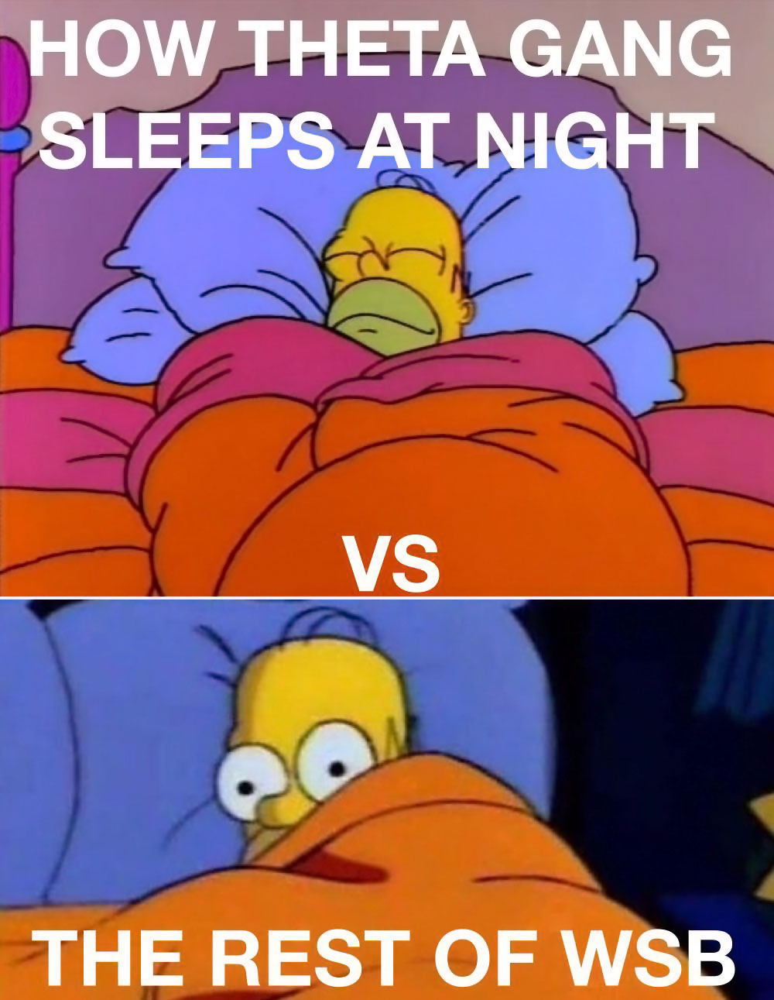
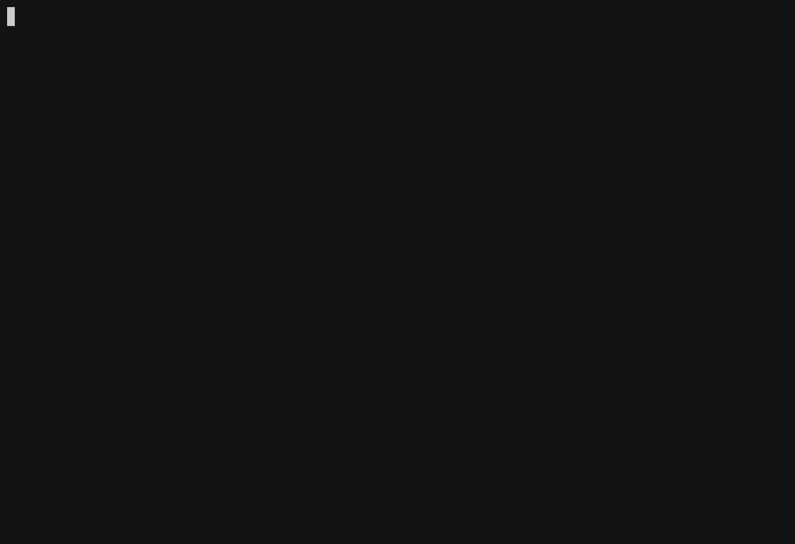

[](https://hub.docker.com/r/brndnmtthws/thetagang) [](https://pypi.org/project/thetagang/) [](https://hub.docker.com/r/brndnmtthws/thetagang) [](https://pypi.python.org/pypi/thetagang/)

[💬 Join the Matrix chat, we can get money together](https://matrix.to/#/#thetagang:frens.io).

# Θ ThetaGang Θ

*Beat the capitalists at their own game with ThetaGang 📈*



ThetaGang is an [IBKR](https://www.interactivebrokers.com/) trading bot for
collecting premium by selling options using "The Wheel" strategy. The Wheel
is a strategy that [surfaced on
Reddit](https://www.reddit.com/r/options/comments/a36k4j/the_wheel_aka_triple_income_strategy_explained/),
but has been used by many in the past. This bot implements a slightly
modified version of The Wheel, with my own personal tweaks.

I've been streaming most of the work on this project [on Twitch, so follow me
over there](https://www.twitch.tv/letsmakestuff).

## How it works

Start by reading [the Reddit
post](https://www.reddit.com/r/options/comments/a36k4j/the_wheel_aka_triple_income_strategy_explained/)
to get some background.

The strategy, as implemented here, does a few things differently from the one
described in the post above. For one, it's intended to be used to augment a
typical index-fund based portfolio with specific asset allocations. For
example, you might want to use a 60/40 portfolio with SPY (S&P500 fund) and
TLT (20 year treasury fund). This strategy reduces risk, but may also limit
gains from big market swingsn.

The main difference between ThetaGang and simply buying and holding index
funds is that this script will attempt to harvest volatility by selling
options, rather than buying shares directly. This works because implied
volatility is typically higher than realized volatility on average. Instead
of buying shares, you write puts. This has pros and cons, which are outside
the scope of this README.

You could use this tool on individual stocks, but I personally don't
recommend it because I am not smart enough to understand which stocks to buy.
That's why I just buy index funds.

ThetaGang will try to acquire your desired allocation of each stock or ETF
according to the weights you specify in the config. To acquire the positions,
the script will write puts when conditions are met (adequate buying power,
acceptable contracts are available, enough shares needed, etc).

ThetaGang will continue to roll any open option positions indefinitely, with
the only exception being ITM puts. Once puts are in the money, they will be
ignored until they expire and are exercised (after which you will own the
underlying).

If puts are exercised due to being ITM at expiration, you will own the
stock, and ThetaGang switches from writing puts to writing calls at a strike
at least as high as the average cost of the stock held.

Please note: this strategy is based on the assumption that implied volatility
is, on average, always higher than realized volatility. In cases where this
is not true, this strategy will cause you to lose money.

In the case of deep ITM calls, the bot will prefer to roll the calls to next
expiration rather than allowing the underlying to get called away. If you
don't have adequate buying power available in your account, it's possible
that the options may get exercised instead of rolling forward and the process
starts back at the beginning. Please keep in mind this may have tax
implications, but that is outside the scope of this README.

In normal usage, you would run the script as a cronjob on a daily, weekly, or
monthly basis according to your preferences. Running more frequently than
daily is not recommended, but the choice is yours.



## Project status

This project is, in its current state, considered to be complete. I'm open
to contributions, but I am unlikely to accept PRs or feature requests that
involve significant changes to the underlying algorithm.

If you find something that you think is a bug, or some other issue, please
[create a new issue](https://github.com/brndnmtthws/thetagang/issues/new).

## "Show me your gains bro" – i.e., what are the returns?

As discussed elsewhere in this README, you must conduct your own research,
and I suggest starting with resources such as CBOE's BXM and BXDM indices,
and comparing those to SPX. I've had a lot of people complain because "that
strategy isn't better than buy and hold BRUH"–let me assure you, that is not
my goal with this.

There are conflicting opinions about whether selling options is good or bad,
more or less risky, yadda yadda, but generally the risk profile for covered
calls and naked puts is no worse than the worst case for simply holding an
ETF or stock. In fact, I'd argue that selling a naked put is better than
buying SPY with a limit order, because at least if SPY goes to zero you keep
the premium from selling the option. The main downside is that returns are
capped on the upside. Depending on your goals, this may not matter. If you're
like me, then you'd rather have consistent returns and give up a little bit
of potential upside.

Generally speaking, the point of selling options is not to exceed the returns
of the underlying, but rather to reduce risk. Reducing risk is an important
feature because it, in turn, allows one to increase risk in other ways
(i.e., allocate higher percentage to stocks or buy riskier assets).

Whether you use this or not is up to you. I have not one single fuck to give,
whether you use it or not. I am not here to convince you to use it, I merely
want to share knowledge and perhaps help create a little bit of wealth
redistribution.

💫

## Requirements

The bot is based on the [ib_insync](https://github.com/erdewit/ib_insync)
library, and uses [IBC](https://github.com/IbcAlpha/IBC) for managing the API
gateway.

To use the bot, you'll need an Interactive Brokers account with a working
installation of IBC. If you want to modify the bot, you'll need an
installation of Python 3.8 or newer with the
[`poetry`](https://python-poetry.org/) package manager.

One more thing: to run this on a live account, you'll require enough capital
to purchase at least 100 shares of the stocks or ETFs you choose. For
example, if SPY is trading at $300/share you'd need $30,000 available. You
can search for lower priced alternatives, but these tend to have low volume
on options which may not be appropriate for this strategy. You should
generally avoid low volume ETFs/stocks. If you don't have that kind of
capital, you'll need to keep renting out your time to the capitalists until
you can become a capitalist yourself. That's the way the pyramid scheme we
call capitalism works.

## Installation

*Before running ThetaGang, you should set up an IBKR paper account to test the
code.*

```console
$ pip install thetagang
```

It's recommended you familiarize yourself with
[IBC](https://github.com/IbcAlpha/IBC) so you know how it works. You'll need
to know how to configure the various knows and settings, and make sure things
like API ports are configured correctly. If you don't want to mess around too
much, consider [running ThetaGang with Docker](#running-with-docker).

## Usage

```console
$ thetagang -h
```

## Up and Running with Docker

My preferred way for running ThetaGang is to use a cronjob to execute Docker
commands. I've built a Docker image as part of this project, which you can
use with your installation. There's a [prebuilt Docker image
here](https://hub.docker.com/repository/docker/brndnmtthws/thetagang).

To run ThetaGang within Docker, you'll need to pass `config.ini` for [IBC
configuration](https://github.com/IbcAlpha/IBC/blob/master/userguide.md) and
[`thetagang.toml`](/thetagang.toml) for ThetaGang. There's a sample
[`ibc-config.ini`](/ibc-config.ini) included in this repo for your convenience.

The easiest way to get the config files into the container is by mounting a
volume.

To get started, grab a copy of `thetagang.toml` and `config.ini`:

```console
$ mkdir ~/thetagang
$ cd ~/thetagang
$ curl -Lq https://raw.githubusercontent.com/brndnmtthws/thetagang/main/thetagang.toml -o ~/thetagang/thetagang.toml
$ curl -Lq https://raw.githubusercontent.com/brndnmtthws/thetagang/main/ibc-config.ini -o ~/thetagang/config.ini
```

Edit `~/thetagang/thetagang.toml` to suit your needs. Pay particular
attention to the symbols and weights. At a minimum, you must change the
username, password, and account number. You may also want to change the
trading move from paper to live when needed.

Now, to run ThetaGang with Docker:

```console
$ docker run --rm -i \
    -v ~/thetagang:/etc/thetagang \
    brndnmtthws/thetagang:latest \
    --config /etc/thetagang/thetagang.toml
```

Lastly, to run ThetaGang as a daily cronjob Monday to Friday at 9am, add
something like this to your crontab (on systems with a cron installation, use
`crontab -e` to edit your crontab):

```crontab
0 9 * * 1-5 docker run --rm -i -v ~/ibc:/etc/thetagang brndnmtthws/thetagang:latest --config /etc/thetagang/thetagang.toml
```

## Determining which ETFs or stocks to run ThetaGang with

I leave this as an exercise to the reader, however I will provide a few
recommendations and resources:

### Recommendations

* Stick with high volume ETFs or stocks
* Careful with margin usage, you'll want to calculate the worst case scenario
  and provide plenty of cushion for yourself based on your portfolio


### Resources

* For discussions about selling options, check out
  [r/thetagang](https://www.reddit.com/r/thetagang/)
* For backtesting portfolios, you can use [this
  tool](https://www.portfoliovisualizer.com/backtest-portfolio) and [this
  tool](https://www.portfoliovisualizer.com/optimize-portfolio) to get an idea
  of drawdown and typical volatility

## Development

Check out the code to your local machine and install the Python dependencies:

```shell
$ poetry install
$ poetry run autohooks activate
$ poetry run thetagang -h
...
```

You are now ready to make a splash! 🐳

## FAQ

| Error                                                                                                      | Cause                                                                                                                            | Resolution                                                                                                                                                                                                                                                                                                                                                                                                                                         |
| ---------------------------------------------------------------------------------------------------------- | -------------------------------------------------------------------------------------------------------------------------------- | -------------------------------------------------------------------------------------------------------------------------------------------------------------------------------------------------------------------------------------------------------------------------------------------------------------------------------------------------------------------------------------------------------------------------------------------------- |
| Requested market data is not subscribed.                                                                   | Requisite market data subscriptions have not been set up on IBKR.                                                                | [Configure](https://www.interactivebrokers.com/en/software/am3/am/settings/marketdatasubscriptions.htm) your market data subscriptions. The default config that ships with this script uses the `Cboe One Add-On Bundle` and the `US Equity and Options Add-On Streaming Bundle`. **Note**: You _must_ fund your account before IBKR will send data for subscriptions. Without funding you can still subscribe but you will get an error from ibc. |
| No market data during competing live session                                                               | Your account is logged in somewhere else, such as the IBKR web portal, the desktop app, or even another instance of this script. | Log out of all sessions and then re-run the script.                                                                                                                                                                                                                                                                                                                                                                                                |
| `ib_insync.wrapper ERROR Error 200, reqId 10: The contract description specified for SYMBOL is ambiguous.` | IBKR needs to know which exchange is the primary exchange for a given symbol.                                                    | You need to specify the primary exchange for the stock. This is normal for companies, typically. For ETFs it usually isn't required. Specify the `primary_exchange` parameter for the symbol, i.e., `primary_exchange = "NYSE"`.                                                                                                                                                                                                                   |

## Support and sponsorship

If you get some value out of this, please consider [sponsoring me](https://github.com/sponsors/brndnmtthws)
to continue maintaining this project well into the future. Like
everyone else in the world, I'm just trying to survive.

If you like what you see but want something different, I am willing
to work on bespoke or custom trading bots for a fee. Reach out
to me directly through my GitHub profile.

## Stargazers over time

[](https://starchart.cc/brndnmtthws/thetagang)
