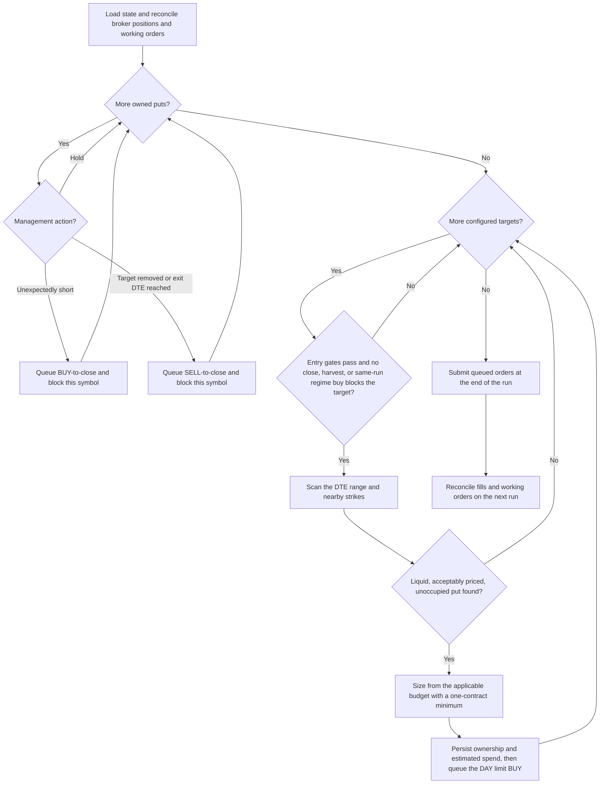
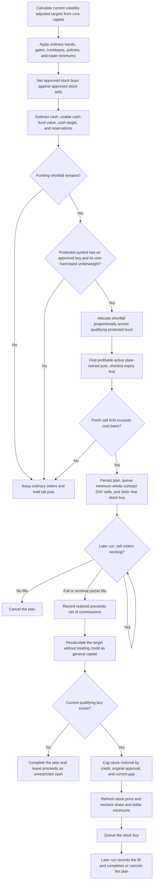

# Tail hedging

ThetaGang's optional tail-hedge strategy maintains independent ladders of long,
deep out-of-the-money puts for one or more portfolio symbols. All targets share
one portfolio-level premium budget, while each target has its own budget share,
entry cadence, gate, contract filters, and expiration ladder.

This is catastrophe insurance rather than protection from ordinary drawdowns.
Premium is expected to create portfolio drag when markets remain calm.

## Runtime flow



Exit failures and working close orders block only the affected symbol. The
engine finishes all risk-reducing work before it evaluates the first new
entry. Entry failures, cadence limits, and gates are also isolated per target,
so one target cannot prevent an unrelated target from progressing.

## Crash harvesting and rebalancing

State-owned tail puts are insurance rather than deployable portfolio capital.
`net_liq_ex_options` removes all option values from the rebalance base;
`net_liq` removes the state-owned tail puts specifically. Realized credit from
an active harvest plan is also removed until that plan completes or is
canceled. Volatility-adjusted weights and allocation gaps are therefore
calculated from core capital before the normal regime logic decides whether a
trade is actionable.

Harvesting is a funding step for a severe, already-approved rebalance. It is not
a separate profit-taking signal:



The funding calculation uses the regime engine's final approved stock orders:

```text
required cash = max(0, approved stock buys - approved stock sells)
ordinary liquidity = max(0,
    TotalCashValue
    + usable cash-fund market value
    - configured cash target
    - active realized tail credit
    - queued buy debits
)
funding shortfall = max(0, required cash - ordinary liquidity)
```

The cash fund is usable only when cash management is enabled. A deposit raises
`TotalCashValue`, so it funds approved buys before any put becomes eligible for
harvesting. If several protected symbols have their own hard-band underweights,
the available shortfall is divided in proportion to their approved buy values.
Whole-share rounding can leave part of a shortfall unharvested.

Only positive long positions belonging to `active` state tranches are eligible.
The first profitability check uses IBKR's positive unrealized P&L when that
field is numeric; otherwise it compares market value per contract with IBKR's
average cost, falling back to the tranche entry cost. Before placing each sale,
the engine fetches a fresh midpoint-or-market quote and requires its limit value
to remain above that cost basis.

Contracts are consumed by ascending expiration. The engine sells the fewest
whole contracts estimated to fund the approved buy, or all eligible profitable
inventory when it is insufficient. Whole-contract rounding may realize more
cash than the approval. The excess does not enlarge the plan's stock order. A
sale never refunds the rolling insurance-premium budget, which measures gross
entry spending rather than net strategy profit.

Before `exit_dte`, no standalone profit target applies. The rebalance and
funding conditions decide whether harvesting is useful; positive profitability
and a fresh sell limit above cost basis prevent realizing a loss for that
purpose.

Put proceeds are actual fill value minus nonnegative commissions. A fully
filled sale or a terminal partially filled sale creates the credit; a terminal
unfilled sale cancels the plan. The stock order's authorized notional is capped
by the lesser of remaining realized credit, the original approved amount, and
the current buy gap. Stock fill cost includes commissions, and any nonnegative
remainder is recorded as unused proceeds. Terminal partial stock fills complete
the plan; a terminal unfilled stock order cancels it.

Each plan's credit can authorize a stock order only for the same symbol. Cash is
not segregated at IBKR, but active credit is excluded from the general rebalance
base and reserved from cash management. Volatility sizing is the master risk
control: harvest proceeds never restore a static allocation or assert that a
crash has ended. The persisted state permits at most one active harvest plan per
symbol.

## Portfolio and target budgets

`annual_budget` is the scaling budget for the complete tail-hedge program over
a rolling 365-day window. Every target receives a `budget_weight`, and the
weights must sum to `1.0`. Each eligible tranche buys at least one put,
so whole-contract granularity can intentionally push the recorded maximum debit
above a tranche, target, or global annual budget.

For each target entry, the engine calculates:

```text
global annual budget = current NLV * annual_budget
target annual budget = global annual budget * budget_weight
tranche allocation = target annual budget / annual_tranches
applicable budget = min(global remaining, target remaining, tranche allocation)
quantity = max(1, floor(applicable budget / contract cost))
```

The one-contract floor ensures that every tranche which passes its cadence,
gate, contract, and annual-count checks has insurance. Contracts two and above
are added only when the complete quantity fits the applicable budget. If the
minimum contract exceeds a tranche allocation or the remaining target or
global annual budget, the state and evaluation records include the floor and
each resulting overrun. Accounting uses the submitted maximum debit rather
than the final fill, which is conservative for price improvement and partial
fills.

Targets are evaluated in configuration order. Every eligible target retains
its one-contract minimum even after an earlier minimum purchase exhausts the
shared budget, but earlier targets have priority for quantities above one.

## Per-target entry gates

Each target must pass these checks independently:

- The account holds a positive stock position in that target symbol.
- Net liquidation value is available and positive.
- Fewer than `annual_tranches` target entries exist in the rolling window.
- At least `365 // annual_tranches` days have elapsed since that target's last
  entry.
- The selected expiration is later than every current state tranche for that
  target, including an enqueued or close-enqueued tranche.
- No regime stock buy for the target was approved in the same run.
- The quote meets the target's open-interest, bid, bid/ask-width, and
  premium-ratio limits.
- When `entry_gate = "vix"`, VIX is at or below `entry_vix_max`.

`entry_gate = "none"` skips only the VIX check for that target. This is useful
when VIX is not an appropriate entry signal for the underlying, such as a
Bitcoin ETF. VIX is fetched once per run and shared by all targets that use it.

## Contract selection

For a target whose gates pass, the engine:

1. Finds that symbol's option chain, preferring the configured order exchange.
2. Sorts eligible expirations by distance from `target_dte`, preferring the
   later expiration on a tie.
3. Takes the five listed OTM strikes closest to `spot * strike_ratio`.
4. Qualifies every expiration-and-strike candidate and removes exact contract
   IDs already held, queued locally, or working at the broker anywhere in the
   account.
5. Requests quotes and chooses the first candidate in expiration/strike rank
   that passes every liquidity and price filter.

The scan can fall back to an adjacent strike or expiration when the closest
contract is unsuitable. Requiring each new expiration to be later than all
current state tranches for the same symbol creates independent expiration
ladders.

## Persistent ownership and order safety

SQLite is required because broker positions do not identify which strategy
owns an option. One normalized `tail_hedge_state` event stores the entire
program:

- Schema version, strategy identifier, and brokerage account.
- Entry-enqueued, active, or close-enqueued tranches, each tagged with its
  target symbol and exact IBKR contract ID.
- Per-symbol rolling entry history and conservative estimated cost.
- Entry and close lifecycle metadata.
- Symbol-specific harvest plans, selected put quantities, target snapshots,
  approved buy amounts, option and stock order references, actual fill
  proceeds, remaining credit, and terminal status.

The engine also records symbol-scoped `tail_hedge_evaluation` events for holds,
rejected entries, queued orders, and isolated failures. State reads ignore
dry-run events and are scoped to the config file path.

New ownership state must be persisted before a risk-increasing BUY is queued.
If persistence fails, that entry is not placed. Risk-reducing closes are queued
first and state recording is best effort, so a database write failure does not
prevent a close.

On the next run, an enqueued tranche becomes active when a positive position
appears. An entry with neither a position nor a working broker order is removed
and its estimated cost is refunded. Filled entries stay in gross-spend history
after a normal or harvested sale.

Removing one or all configured targets requests cancellation of their working
entries and queues closes for remaining owned puts, unless an active harvest
plan controls that symbol or contract. A removed target's pending
`harvest_requested` plan is canceled; ready but unused credit is completed and
left as cash; working put sales or stock buys reconcile to a terminal state.
An enabled program with no targets is therefore a valid cleanup state and cannot
open a new position. Portfolio snapshots include state-owned positions whose
symbols are absent from `portfolio.symbols`.

The harvest lifecycle is persisted as:

```text
harvest_requested -> put_sell_working -> proceeds_realized
    -> rebalance_credit_ready -> [stock_buy_enqueued] -> completed
```

Any working-order stage may instead become `canceled` when it ends without a
fill. Broker executions are saved to SQLite, including commissions, and exact
plan order references let later runs recover fills beyond the current IBKR
response. If quote retrieval or enqueueing fails while a plan is
`harvest_requested`, the stock buy is suppressed and the request is
retried on a later run.

## Interaction with other strategies

### Wheel

All state-owned tail puts are excluded from wheel net-contract calculations,
short-put management, and roll destinations. Their exact contract IDs are also
excluded from wheel writes. Conversely, the tail scanner excludes put contract
IDs already held or queued by any strategy, preventing ambiguous ownership of
the same IBKR position.

If ownership state cannot be read, wheel put writes, management, and rolls stop
rather than acting without reliable ownership data. Call management is
unaffected.

### Regime rebalancing

With the `net_liq_ex_options` weight base, all option market values are removed
from net liquidation before allocation targets are calculated. With `net_liq`,
only state-owned tail puts are removed. In either mode, unrealized insurance
gains do not raise core or deployable rebalance capital. `managed_stocks`
derives its base solely from managed stock positions.

At `exit_dte`, the strategy sells an unharvested put. Before then, a profitable
put is harvested only when its own protected symbol has an actionable buy, its
own relative underweight reaches `hard_band`, and the complete set of approved
stock trades cannot be funded from ordinary liquidity. Soft-band, inferred-flow,
and other symbols' hard-band decisions cannot trigger its harvest. The put sale
and stock buy cannot be submitted in the same run. Actual put fills create
reserved, symbol-specific credit, and a later run must revalidate the current
volatility-adjusted gap before it can submit the stock order.

`net_liq_ex_options` removes unrelated option values from the rebalance base.
This lets manually held overlay options, such as LEAP calls, remain outside
normal allocation sizing. Only exact contracts in tail-hedge state can be
selected for harvesting or DTE management.

### Cash management

With `run.strategies`, canonical order runs regime rebalancing and then the tail
stage before cash management. Regime harvesting counts available cash and, when
cash management is enabled, the cash fund's positive market value less the cash
target. It also subtracts active realized tail credit and any buy orders already
queued by earlier stages. This makes deposits and the cash fund ordinary funding
sources while preventing reserved credit or another queued debit from being
counted twice.

Every queued hedge debit is included in cash management's pending balance.
Estimated proceeds from a working harvest sale and remaining realized credit
are reserved until the plan completes or is canceled. A `harvest_requested`
plan is not reserved until its put sale is actually queued. Thus a queued put
sale does not create sweepable cash, and realized credit remains unavailable to
the cash-fund sweep while the later stock buy is pending.

Explicit `run.stages` configurations remain user-defined, but the validator
requires `equity_regime_rebalance` before `post_tail_hedge` and both before
`post_cash_management` when those stages coexist. This preserves same-run entry
suppression, includes queued hedge debits, and applies cash reservations before
the cash-fund sweep.

## Configuration

The long-put entry and DTE-exit program may run alongside either
`regime_rebalance` or `wheel`. Crash harvesting and symbol-specific reinvestment
run only through `regime_rebalance`; with wheel alone, profitable puts are held
until `exit_dte`. Wheel and regime rebalancing cannot run alongside each other.
Every target symbol must exist in `portfolio.symbols`, target symbols must be
unique, and configured target budget weights must sum to `1.0`.

For entries and DTE exits, both tail-hedge switches matter:
`tail_hedge` must appear in `run.strategies` (or `post_tail_hedge` in explicit
`run.stages`) and `[strategies.tail_hedge].enabled` must be `true`. Crash
harvesting additionally requires the regime stage, an enabled
`[strategies.regime_rebalance]`, and the protected symbol in its `symbols`
list. SQLite must be enabled. Tail hedging is rejected when regime rebalancing
has `shares_only = true`, because the strategy requires option trading.

```toml
[run]
strategies = ["regime_rebalance", "tail_hedge", "cash_management"]

[runtime.database]
enabled = true
path = "data/thetagang.db"

[strategies.regime_rebalance]
enabled = true
symbols = ["QQQ", "IBIT"]
shares_only = false

[strategies.cash_management]
enabled = true

[strategies.tail_hedge]
enabled = true
annual_budget = 0.005

[[strategies.tail_hedge.targets]]
symbol = "QQQ"
budget_weight = 0.60
annual_tranches = 4
entry_gate = "vix"
entry_vix_max = 20.0
target_dte = 180
min_dte = 150
max_dte = 210
exit_dte = 30
strike_ratio = 0.60
minimum_open_interest = 50
minimum_bid = 0.01
max_bid_ask_ratio = 0.50
max_premium_ratio = 0.05

[[strategies.tail_hedge.targets]]
symbol = "IBIT"
budget_weight = 0.40
annual_tranches = 4
entry_gate = "none"
target_dte = 180
min_dte = 150
max_dte = 210
exit_dte = 30
strike_ratio = 0.60
minimum_open_interest = 25
minimum_bid = 0.01
max_bid_ask_ratio = 0.50
max_premium_ratio = 0.08
```

The QQQ and IBIT values above illustrate the shape of the configuration, not a
recommended allocation or calibrated parameter set. Correlation does not make
the positions interchangeable: their option markets, volatility regimes, and
tail events differ. A shared budget limits total insurance drag, while separate
targets preserve independent contracts, schedules, gates, and attribution.

## Defaults and limitations

The program defaults to disabled with an annual budget of `0.005` (0.5% of
NLV). Target defaults are four annual tranches, a VIX gate at `20`, a `180`-day
target inside a `150`-to-`210`-day range, exit at `30` DTE, a `0.60`
strike-to-spot ratio, minimum open interest of `50`, minimum bid of `0.01`,
maximum bid/ask ratio of `0.50`, and maximum premium/spot ratio of `0.05`.
`budget_weight` and `symbol` are always explicit.

- Coverage is conditional. Gates, liquidity, cadence, or a missing later
  expiration can leave gaps.
- Each eligible tranche buys at least one contract, so small budgets and costly
  puts can exceed the configured tranche, target, or global annual budget.
- Sizing uses total account NLV. Target stock value is an entry gate, not its
  sizing base.
- Profitable puts can be harvested only through an actionable regime rebalance;
  the protected symbol must also breach its own hard underweight band and the
  approved stock orders must have an ordinary-liquidity shortfall. Otherwise
  they are held until `exit_dte`.
- Ownership is by exact contract ID, not tax lot. IBKR nets manual and
  strategy positions in the same contract, so do not manually trade an owned
  tail contract.
- Standard delayed order repricing may apply when enabled for a target symbol.
