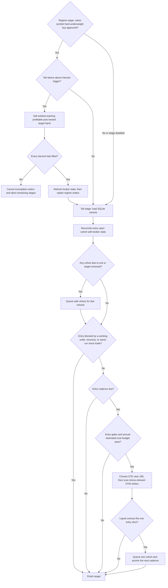

# Tail hedging

ThetaGang can keep a rolling ladder of long, out-of-the-money puts for one or
more portfolio symbols. It spreads entries through the year to reduce entry-date
timing risk while keeping estimated insurance spending within an annual budget.
Among otherwise eligible contracts in the preferred expiration, it favors the
best configured catastrophe-payout multiple. Each purchase is one cohort (the
timing tranche). The program may leave
a gap when puts are expensive, illiquid, or unavailable near the requested
dates. The design is inspired by Taleb and Spitznagel's broad emphasis on owning
limited-loss convexity without trying to predict crashes; these rules and DTE
defaults are ThetaGang's, not a claim about either author's exact prescription.

## Entries and exits

On each `tail_hedge` stage, ThetaGang:

1. Matches its saved cohorts to live positions and working orders.
2. Closes an owned put when it reaches `exit_dte` or its target is removed.
3. Considers at most one new cohort for each eligible target.
4. Chooses an expiration near `target_dte`, then ranks every relevant OTM strike
   by catastrophe payout per estimated all-in dollar and entry-budget dollar.
5. Places a midpoint-priced limit order for the whole-contract quantity that
   fits the budget.



The expiration must be within `min_dte` and `max_dte`; the defaults scan from
120 through 240 DTE and prefer the expiration closest to the 180-DTE target.
Expiration dates do not have to be evenly spaced. A later purchase may use the
same expiration at a different strike: the primary diversification is the entry
date, not a promise of distinct maturities. Within each expiration, the scanner
considers every OTM strike with positive intrinsic payout in at least one
configured catastrophe scenario. It excludes an exact contract already held,
queued, or working. Quotes must also pass the bid, open-interest, spread,
premium, and whole-contract budget filters.

An entry is skipped when the account has no long stock position in the target,
trading is disabled for the symbol, another entry is working, or the same run
already queued any stock order or a tail close for that symbol. Targets are
evaluated independently, so a failure for one does not stop the others.

Setting `no_trading = true` on a portfolio symbol blocks both entries and exits
for that symbol.

## Budget and timing

`annual_budget` is a fraction of current net liquidation value and applies to
all targets. Entry cost includes the submitted limit premium plus
`runtime.orders.estimated_fee_per_contract`. Entries remain in the budget for
365 days; any unrecovered cost on an older open cohort continues to count until
it closes. Age alone never makes
live protection free. `budget_weight` divides the budget between targets; the
weights must add up to `1.0`.

`entries_per_year` divides each target's annual cost budget into equal
entry slices and sets the cadence:

```text
target annual cost budget = current NLV * annual_budget * budget_weight
entry slice               = target annual cost budget / entries_per_year
entry cadence             = ceil(365 / entries_per_year) days
all-in contract cost      = limit premium * multiplier + estimated fee
quantity                  = floor(applicable remaining budget / all-in contract cost)
```

The default of six entries per year gives a 61-day cadence. Each order is
limited by one entry slice plus the remaining target and program budgets. No
order is placed unless at least one whole contract fits.

Only an entry that remains queued or fills anchors the next cadence. A canceled,
unfilled order releases its reservation and does not delay the next attempt. If
an entry is blocked by the gate, filters, budget, or sparse expirations,
ThetaGang retries on a later run. It never accumulates missed slices or submits
catch-up purchases.

With the default 180-DTE entry target and 30-DTE exit, a put is normally held
for about 150 days. A 61-day cadence therefore produces roughly two to three
live cohorts in steady state, but this is an expectation rather than a target
count. Available expirations and entry filters determine the actual ladder.

An unfilled sell order does not restore budget. After the broker position shows
an actual reduction, ThetaGang credits the originating cohort, capped at that
cohort's entry cost. A complete reduction with a usable IBKR average fill price
uses that fill price less the configured estimated fee. Partial or ambiguous
reconciliation keeps the conservative recovery value recorded when the order
was created. This makes remaining premium from a normal DTE exit available
within the rolling annual budget without enlarging the next entry slice. A
crash gain can reduce the cohort's net cost to zero, but it cannot create extra
hedge budget.

Budget accounting is not an execution-and-commission ledger. It can reconcile
the average fill price for a complete sale, but actual commissions are still
represented by `runtime.orders.estimated_fee_per_contract`.

Within the nearest eligible expiration, each liquid and affordable candidate
receives two model-free catastrophe scores. For every configured drawdown,
ThetaGang computes the put's intrinsic payout at that shocked underlying price.
The raw score divides the average payout by the estimated all-in contract cost.
The primary score divides the payout from all whole contracts that fit by the
available entry budget, accounting for unusable cash left by contract rounding.
The highest primary score wins; raw score, spread, open interest, contract cost,
and conId provide deterministic tie-breaks.

IBKR model implied volatility, price, delta, gamma, vega, and theta are recorded
when available. They are diagnostics rather than ranking inputs: the catastrophe
score uses contractual intrinsic payout and the executable limit price, without
assuming that local model sensitivities extrapolate to a discontinuous shock.
Selection telemetry stores the chosen quote and the five highest-ranked
alternatives so real runs can be compared and refined later.

With `entry_gate = "vix"`, ThetaGang waits while VIX is above `entry_vix_max`.
Use `entry_gate = "none"` to disable only the VIX check; all other entry rules
still apply.

## Selling puts during a drawdown

When `regime_rebalance` is also running, ThetaGang can rotate part of a
profitable tail hedge into a same-symbol stock buy. Harvesting never bypasses
the allocation policy: volatility and dynamic sizing must first produce an
approved buy past the stock's hard-underweight band.

The second condition is a portfolio-level allocation band. The market value of
all state-owned tail puts must be greater than `harvest_trigger_weight` of
the configured regime-rebalancing base. ThetaGang then sizes sales toward
`harvest_target_weight` of that same base. The target sale budget is the value
of the tail sleeve above that target, without consulting broker cash. The
defaults trigger above 5% of the regime base and target 3%. They are
configurable policy values, not calibrated recommendations.

The separation between the trigger and target is the hysteresis. After a sale
toward 3%, enough eligible fills normally leave no reason for another daily
harvest in a flat or recovering market. A later sale requires the remaining
sleeve to be above 5% again and the same-symbol hard-underweight buy to remain
approved. No crash episode, trough, profit-tier, or recovery state is needed.

Harvesting uses the exact same `weight_base` calculation as regime rebalancing.
With the default `net_liq_ex_options`, options on active regime symbols and all
state-owned tail puts are removed from broker `NetLiquidation`. Unrelated
financing options, including SPX box-spread legs, remain netted against their
cash proceeds inside `NetLiquidation`; cash-fund holdings also remain included.
`net_liq` removes only state-owned tail puts, while `managed_stocks` uses only
the managed regime stock value. For example, $100,000 of broker NLV containing
$5,000 of state-owned tail puts produces a $95,000 adjusted NLV. The final
regime base is `floor($95,000 * regime margin_usage)`, and the sleeve weight is
`$5,000 / final regime base`. It is about 5.26% when the multiplier is 1.0 and
about 4.39% when the multiplier is 1.2.

The numerator contains only live, state-owned tail puts. The amount available
for conversion is determined from the band, not from reported cash or the
preliminary size of the stock order. After option quotes return, ThetaGang
rechecks both the live sleeve and the latest available NLV and rebuilds the
regime base before committing a sale, so the two sides of the ratio are not
intentionally taken from different market moments.

After a fill, excluded put value has become included cash, so the refreshed
regime base can increase. The target weight is therefore a sale-sizing reference
for the pre-sale snapshot, not a guarantee of the exact post-fill weight; whole
contract rounding and refreshed marks can move the result slightly below it.

Only active, state-owned puts without a conflicting order are eligible.
ThetaGang walks profitable cohorts by earliest expiration and sells only as
many whole contracts as needed along that ordering to move the sleeve toward
its target. Contract rounding may overshoot the target sale budget by less than
one selected contract. Newly purchased or still-unprofitable cohorts
remain invested rather than being used merely because the total sleeve crossed
the trigger. The submitted limit carries both a fee-aware floor above the
cohort's cost basis and a floor strictly above the price implied by the trigger.
A hedge barely above the trigger therefore cannot be chased down to break-even
or sold after it has fallen back to the upper-band boundary.

ThetaGang submits a newly selected harvest as a bounded first phase, waits once
at the original limit, and may reprice once toward the midpoint without crossing
the higher of those two floors. Every harvest must fully fill. Otherwise,
ThetaGang cancels incomplete orders and aborts the remaining stages without
submitting stock or cash-fund orders from that plan.

After complete fills, ThetaGang refreshes IBKR account and portfolio state and
recalculates the regime rebalance in the same run from prior-run smoothing state.
The recalculated allocation, not estimated option proceeds, determines the stock
order. The preliminary quote is never treated as a fill, and the preliminary
stock order is never submitted ahead of the harvest. If any recalculated stock
order cannot be prepared completely, ThetaGang aborts loudly before the final
submission batch instead of treating the partial rebalance as successful.

If any state-owned tail reduction still has unresolved recovery state, a new
portfolio harvest is blocked without changing an otherwise approved stock
order. The later tail stage reconciles the sale and its actual average fill when
available. This portfolio-wide lock prevents a pending sale in one target from
being double-counted as excess available for another. ThetaGang runs only one
bounded harvest phase per invocation.

Entry evaluations record premium, estimated fees, catastrophe payouts and
score, order size, open interest, and the quantity/open-interest ratio. Harvest
events record the sleeve value and weight, band settings, sale budget, estimated
gross and net proceeds, fees, and the approved rebalance. The same details are
included in concise run logs.

## State and safe shutdown

Tail hedging requires a file-backed SQLite database. Each cohort is a row in a
dedicated SQLite table, scoped to the IBKR account, with its exact contract
ownership and entry-budget facts. It does not use a JSON state file or JSON
state blob. Ownership is saved before a buy order is queued. Dry-run changes are
visible during that run but are ignored by later live runs.

Run only one ThetaGang process for an IBKR account at a time. Order submission,
portfolio rebalancing, and cohort reconciliation all assume one process owns the
account's run.

State-owned puts are excluded from wheel management. With regime rebalancing,
`net_liq` excludes those puts from its allocation base. `net_liq_ex_options`
excludes options on active regime symbols plus state-owned tail puts, including
tail puts outside the regime sleeve. It does not subtract unrelated financing
or overlay options again: their cash and option liability are already netted in
broker `NetLiquidation`. `managed_stocks` uses managed stock value only. If
ownership state cannot be read, wheel paths that need it fail closed instead of
treating the puts as unowned.

Do not trade a state-owned put manually. IBKR combines manual and automated
positions in the same contract, so ThetaGang cannot tell them apart.

Disabling the strategy stops creating or managing tail actions and does not
unwind the ladder. On startup, ThetaGang cancels stale tail-entry orders but
leaves working close and harvest orders alone. To retire a target:

1. Leave tail hedging enabled and ensure trading is allowed for the symbol.
2. Remove the target and run ThetaGang until its positions and working orders
   are gone.
3. Then disable the strategy or remove the remaining target configuration.

## Configuration

```toml
[run]
strategies = ["tail_hedge"]

[runtime.database]
enabled = true
path = "data/thetagang.db"

[runtime.orders]
estimated_fee_per_contract = 1.0

[strategies.tail_hedge]
enabled = true
annual_budget = 0.005
harvest_trigger_weight = 0.05
harvest_target_weight = 0.03

[[strategies.tail_hedge.targets]]
symbol = "QQQ"
budget_weight = 1.0
entries_per_year = 6
entry_gate = "vix"
entry_vix_max = 20.0
target_dte = 180
min_dte = 120
max_dte = 240
exit_dte = 30
minimum_open_interest = 50
minimum_bid = 0.01
max_bid_ask_ratio = 0.50
max_premium_ratio = 0.05
catastrophe_drawdowns = [0.40, 0.50, 0.60]
```

When tail hedging is enabled, each target symbol must also appear in
`portfolio.symbols`. Enable `regime_rebalance` and add it alongside `tail_hedge`
in `run.strategies` if you want profitable puts to be monetized during
hard-underweight buys. Tail-hedge option trading and regime share rebalancing
are independent stages; the deprecated `regime_rebalance.shares_only` setting
has no effect.

The values above show the configuration shape. They are not trading advice or
calibrated defaults for every account.
