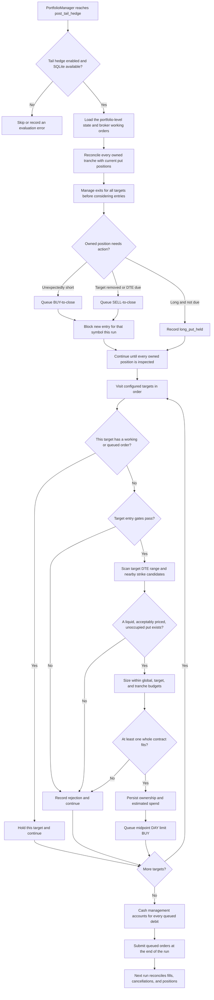

# Tail hedging

ThetaGang's optional tail-hedge strategy maintains independent ladders of long,
deep out-of-the-money puts for one or more portfolio symbols. All targets share
one portfolio-level premium budget, while each target has its own budget share,
entry cadence, gate, contract filters, and expiration ladder.

This is catastrophe insurance rather than protection from ordinary drawdowns.
The strategy buys puts only; it does not create vertical spreads or write a
short leg. Premium is expected to create portfolio drag when markets remain
calm.

## Runtime flow



Exit failures and working close orders block only the affected symbol. The
engine still finishes all risk-reducing work before it evaluates the first new
entry. Entry failures, cadence limits, and gates are also isolated per target,
so one target cannot prevent an unrelated target from progressing.

## Portfolio and target budgets

`annual_budget` is the maximum estimated entry premium for the complete
tail-hedge program over a rolling 365-day window. Every target receives a
`budget_weight`, and the weights must sum to `1.0`.

For each target entry, the engine calculates:

```text
global annual budget = current NLV * annual_budget
target annual budget = global annual budget * budget_weight
tranche allocation = target annual budget / annual_tranches
entry budget = min(global remaining, target remaining, tranche allocation)
quantity = floor(entry budget / (limit price * contract multiplier))
```

Contract quantities never round up. If one contract exceeds the entry budget,
the target records `tranche_budget_too_small` and waits. Accounting uses the
submitted maximum debit rather than the final fill, which is conservative for
price improvement and partial fills.

Targets are evaluated in configuration order. The per-target caps normally
make order irrelevant, but earlier targets have priority if rounding or an
unusual history leaves less global budget than their remaining allocations.

## Per-target entry gates

Each target must pass these checks independently:

- The account holds a positive stock position in that target symbol.
- Net liquidation value is available and positive.
- Fewer than `annual_tranches` target entries exist in the rolling window.
- At least `365 // annual_tranches` days have elapsed since that target's last
  entry.
- The global, target, and tranche budgets can fund at least one contract.
- The selected expiration is later than that target's active tranches.
- The quote meets the target's open-interest, bid, bid/ask-width, and
  premium-ratio limits.
- When `entry_gate = "vix"`, VIX is at or below `entry_vix_max`.

`entry_gate = "none"` skips only the VIX check for that target. This is useful
when VIX is not an appropriate entry signal for the underlying, such as a
Bitcoin ETF. VIX is fetched once per run and shared by all targets that use it.

## Contract selection

For a target whose gates pass, the engine:

1. Finds that symbol's option chain, preferring the configured order exchange.
2. Sorts eligible expirations by distance from `target_dte`, preferring the
   later expiration on a tie.
3. Takes the five listed OTM strikes closest to `spot * strike_ratio`.
4. Qualifies every expiration-and-strike candidate and removes exact contract
   IDs already held, queued locally, or working at the broker anywhere in the
   account.
5. Requests quotes and chooses the first candidate in target order that passes
   every liquidity and price filter.

The scan can fall back to an adjacent strike or expiration when the closest
contract is unsuitable. Requiring each new expiration to be later than all
active tranches for the same symbol creates independent expiration ladders.

## Persistent ownership and order safety

SQLite is required because broker positions do not identify which strategy
owns an option. One normalized `tail_hedge_state` event stores the entire
program:

- Schema version, strategy identifier, and brokerage account.
- Active or enqueued tranches, each tagged with its target symbol and exact
  IBKR contract ID.
- Per-symbol rolling entry history and conservative estimated cost.
- Entry and close lifecycle metadata.

The engine also records symbol-scoped `tail_hedge_evaluation` events for holds,
rejected entries, queued orders, and isolated failures. State reads ignore
dry-run events and are scoped to the config file path.

New ownership state must be persisted before a risk-increasing BUY is queued.
If persistence fails, that entry is not placed. Risk-reducing closes are queued
first and state recording is best effort, so a database write failure does not
prevent a close.

On the next run, an enqueued tranche becomes active when a positive position
appears. An entry with neither a position nor a working broker order is removed
and its estimated cost is refunded. Removing one or all configured targets
cancels their working entries and queues closes for their remaining owned puts.
An enabled program with no targets is therefore a valid cleanup state and cannot
open a new position. Cleanup still sees state-owned positions after their symbol
has also been removed from `portfolio.symbols`.

## Interaction with other strategies

### Wheel

All state-owned tail puts are excluded from wheel net-contract calculations,
short-put management, and roll destinations. Their exact contract IDs are also
excluded from wheel writes. Conversely, the tail scanner excludes put contract
IDs already held or queued by any strategy, preventing ambiguous ownership of
the same IBKR position.

If ownership state cannot be read, wheel put writes, management, and rolls stop
rather than acting without reliable ownership data. Call management is
unaffected.

### Regime rebalancing

With the `net_liq_ex_options` weight base, ordinary option market values are
removed from net liquidation before allocation targets are calculated.
State-owned tail puts are the exception: their market value remains in the
allocation base. A put gain can therefore fund purchases during a drawdown
before the put itself is closed.

### Cash management

The tail stage runs before cash management. Every queued hedge debit is included
in the pending cash balance, preventing cash management from spending the same
cash on the configured cash-equivalent fund.

## Configuration

The feature may run alongside either `regime_rebalance` or `wheel`. Those two
strategies cannot run alongside each other. Every target symbol must exist in
`portfolio.symbols`, target symbols must be unique, and configured target budget
weights must sum to `1.0`.

```toml
[run]
strategies = ["regime_rebalance", "tail_hedge", "cash_management"]

[runtime.database]
enabled = true
path = "data/thetagang.db"

[strategies.tail_hedge]
enabled = true
annual_budget = 0.005

[[strategies.tail_hedge.targets]]
symbol = "QQQ"
budget_weight = 0.60
annual_tranches = 4
entry_gate = "vix"
entry_vix_max = 20.0
target_dte = 180
min_dte = 150
max_dte = 210
exit_dte = 30
strike_ratio = 0.60
minimum_open_interest = 50
minimum_bid = 0.01
max_bid_ask_ratio = 0.50
max_premium_ratio = 0.05

[[strategies.tail_hedge.targets]]
symbol = "IBIT"
budget_weight = 0.40
annual_tranches = 4
entry_gate = "none"
target_dte = 180
min_dte = 150
max_dte = 210
exit_dte = 30
strike_ratio = 0.60
minimum_open_interest = 25
minimum_bid = 0.01
max_bid_ask_ratio = 0.50
max_premium_ratio = 0.08
```

The QQQ and IBIT values above illustrate the shape of the configuration, not a
recommended allocation or calibrated parameter set. Correlation does not make
the positions interchangeable: their option markets, volatility regimes, and
tail events differ. A shared budget limits total insurance drag, while separate
targets preserve independent contracts, schedules, gates, and attribution.

## Defaults and limitations

Target defaults are four annual tranches, a VIX gate at `20`, a `180`-day
target inside a `150`-to-`210`-day range, exit at `30` DTE, a `0.60`
strike-to-spot ratio, minimum open interest of `50`, and the quote filters shown
above. `budget_weight` and `symbol` are always explicit.

- Coverage is conditional. Gates, liquidity, whole-contract sizing, or a
  missing later expiration can leave gaps.
- Sizing uses total account NLV. Target stock value is an entry gate, not its
  sizing base.
- There is no crash-profit exit; puts are normally held until `exit_dte`.
- Ownership is by exact contract ID, not tax lot. IBKR nets manual and
  strategy positions in the same contract, so do not manually trade an owned
  tail contract.
- Standard delayed order repricing may apply when enabled for a target symbol.
