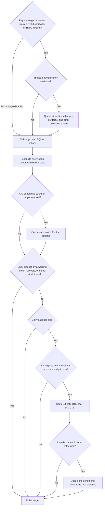

# Tail hedging

ThetaGang can keep a rolling ladder of long, out-of-the-money puts for one or
more portfolio symbols. It spreads entries through the year to reduce entry-date
timing risk while keeping net insurance spending within an annual net premium
budget. Each purchase is one cohort (the timing tranche). The program may leave
a gap when puts are expensive, illiquid, or unavailable near the requested
dates. The design is inspired by Taleb and Spitznagel's broad emphasis on owning
limited-loss convexity without trying to predict crashes; these rules and DTE
defaults are ThetaGang's, not a claim about either author's exact prescription.

## Entries and exits

On each `tail_hedge` stage, ThetaGang:

1. Matches its saved cohorts to live positions and working orders.
2. Closes an owned put when it reaches `exit_dte` or its target is removed.
3. Considers at most one new cohort for each eligible target.
4. Chooses an expiration near `target_dte` and a strike near
   `spot * strike_ratio`.
5. Places a midpoint-priced limit order for the whole-contract quantity that
   fits the budget.



The expiration must be within `min_dte` and `max_dte`; the defaults scan from
120 through 240 DTE and prefer the expiration closest to the 180-DTE target.
Expiration dates do not have to be evenly spaced. A later purchase may use the
same expiration at a different strike: the primary diversification is the entry
date, not a promise of distinct maturities. The scanner still excludes an exact
contract already held, queued, or working. Quotes must also pass the bid,
open-interest, spread, and premium filters.

An entry is skipped when the account has no long stock position in the target,
trading is disabled for the symbol, another entry is working, or the same run
already queued any stock order or a tail close for that symbol. Targets are
evaluated independently, so a failure for one does not stop the others.

Setting `no_trading = true` on a portfolio symbol blocks both entries and exits
for that symbol.

## Budget and timing

`annual_budget` is a fraction of current net liquidation value and applies to
all targets. Entries remain in the budget for 365 days; any unrecovered cost on
an older open cohort continues to count until it closes. Age alone never makes
live protection free. `budget_weight` divides the budget between targets; the
weights must add up to `1.0`.

`entries_per_year` divides each target's annual net premium budget into equal
entry slices and sets the cadence:

```text
target annual net premium budget = current NLV * annual_budget * budget_weight
entry slice                      = target annual net premium budget / entries_per_year
entry cadence                    = ceil(365 / entries_per_year) days
quantity                         = floor(applicable remaining budget / contract cost)
```

The default of six entries per year gives a 61-day cadence. Each order is
limited by one entry slice plus the remaining target and program budgets. No
order is placed unless at least one whole contract fits.

Only an entry that remains queued or fills anchors the next cadence. A canceled,
unfilled order releases its reservation and does not delay the next attempt. If
an entry is blocked by the gate, filters, budget, or sparse expirations,
ThetaGang retries on a later run. It never accumulates missed slices or submits
catch-up purchases.

With the default 180-DTE entry target and 30-DTE exit, a put is normally held
for about 150 days. A 61-day cadence therefore produces roughly two to three
live cohorts in steady state, but this is an expectation rather than a target
count. Available expirations and entry filters determine the actual ladder.

An unfilled sell order does not restore budget. After the broker position shows
an actual reduction, ThetaGang credits the originating cohort using a
recorded sell-limit value, capped at that cohort's entry cost. This makes
remaining premium from a normal DTE exit available within the rolling annual
budget without enlarging the next entry slice. A crash gain can reduce the
cohort's net cost to zero, but it cannot create extra hedge budget.

Budget accounting uses submitted limit values rather than an execution and
commission ledger, so commissions and favorable fill-price improvement are not
included.

With `entry_gate = "vix"`, ThetaGang waits while VIX is above `entry_vix_max`.
Use `entry_gate = "none"` to disable only the VIX check; all other entry rules
still apply.

## Selling puts during a drawdown

When `regime_rebalance` is also running, ThetaGang can sell a profitable tail
put to help fund a same-symbol stock buy. Harvesting never creates or enlarges
the allocation: volatility and dynamic sizing must first produce an approved buy
past the stock's hard-underweight band. Normal funding is applied first,
including the configured cash reserve, queued buy debits, approved stock sales,
and usable cash-fund value when cash management runs later. Only the remaining
shortfall can trigger a harvest.

Only active, state-owned puts without a conflicting order are eligible. The
live sell quote must be above the IBKR average cost; the saved entry price is
used when that cost is unavailable. The profit check does not include
commissions.

ThetaGang uses the earliest-expiring useful cohort and sells the fewest whole
contracts needed. It sells at most one cohort per target in a run. The part of
the stock buy covered by normal funding stays in the current run. Shares assigned
to the shortfall are deferred, even if the chosen cohort can fund only some of
them. Estimated put proceeds are never spent immediately. After the sale fills
and IBKR reports the cash, a later run makes a new rebalance decision.

## State and safe shutdown

Tail hedging requires a file-backed SQLite database. Each cohort is a row in a
dedicated SQLite table, scoped to the IBKR account, with its exact contract
ownership and entry-budget facts. It does not use a JSON state file or JSON
state blob. Ownership is saved before a buy order is queued. Dry-run changes are
visible during that run but are ignored by later live runs.

Run only one ThetaGang process for an IBKR account at a time. Order submission,
portfolio rebalancing, and cohort reconciliation all assume one process owns the
account's run.

State-owned puts are excluded from wheel management. With regime rebalancing,
`net_liq` excludes those puts from its allocation base, `net_liq_ex_options`
excludes all options, and `managed_stocks` uses managed stock value only.
If ownership state cannot be read, wheel paths that need it fail closed instead
of treating the puts as unowned.

Do not trade a state-owned put manually. IBKR combines manual and automated
positions in the same contract, so ThetaGang cannot tell them apart.

Disabling the strategy stops creating or managing tail actions and does not
unwind the ladder. On startup, ThetaGang cancels stale tail-entry orders but
leaves working close and harvest orders alone. To retire a target:

1. Leave tail hedging enabled and ensure trading is allowed for the symbol.
2. Remove the target and run ThetaGang until its positions and working orders
   are gone.
3. Then disable the strategy or remove the remaining target configuration.

## Configuration

```toml
[run]
strategies = ["tail_hedge"]

[runtime.database]
enabled = true
path = "data/thetagang.db"

[strategies.tail_hedge]
enabled = true
annual_budget = 0.005

[[strategies.tail_hedge.targets]]
symbol = "QQQ"
budget_weight = 1.0
entries_per_year = 6
entry_gate = "vix"
entry_vix_max = 20.0
target_dte = 180
min_dte = 120
max_dte = 240
exit_dte = 30
strike_ratio = 0.60
minimum_open_interest = 50
minimum_bid = 0.01
max_bid_ask_ratio = 0.50
max_premium_ratio = 0.05
```

When tail hedging is enabled, each target symbol must also appear in
`portfolio.symbols`. If regime rebalancing is enabled,
`regime_rebalance.shares_only` must be `false`. Enable
`regime_rebalance` and add it to `run.strategies` if you want profitable puts to
fund hard-underweight buys.

The values above show the configuration shape. They are not trading advice or
calibrated defaults for every account.
